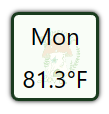
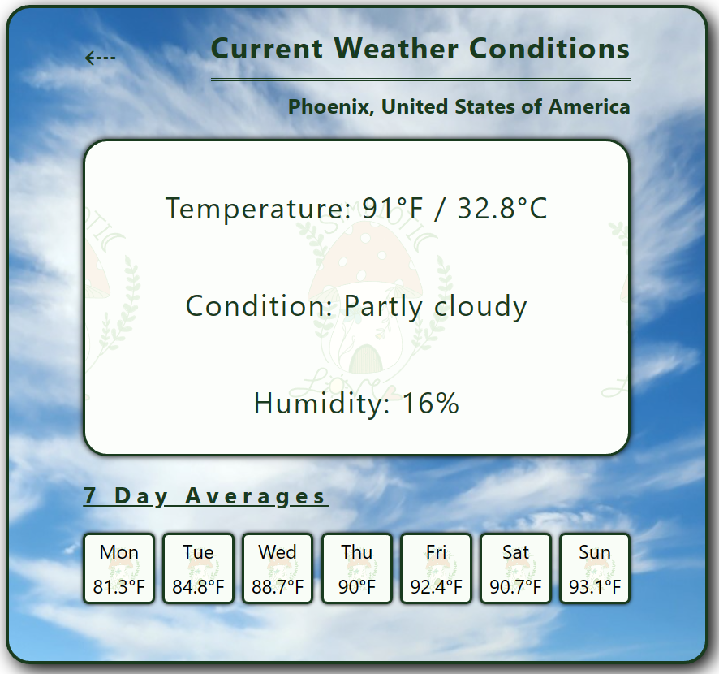
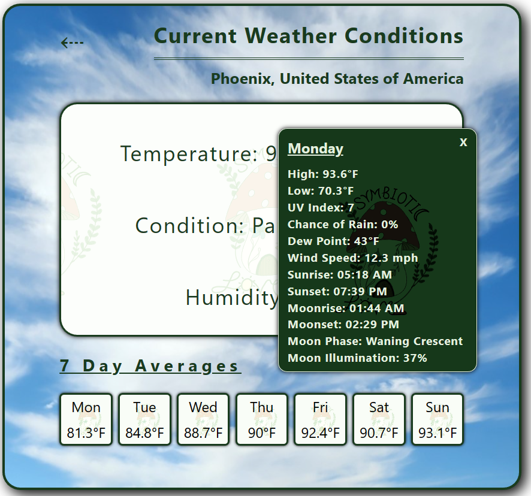
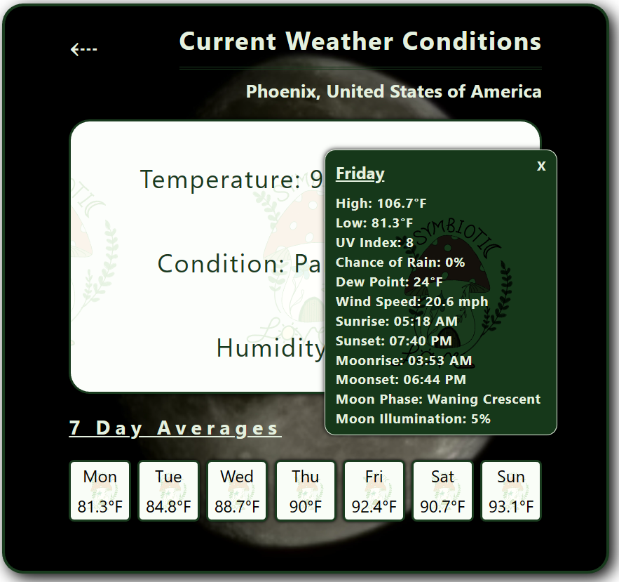
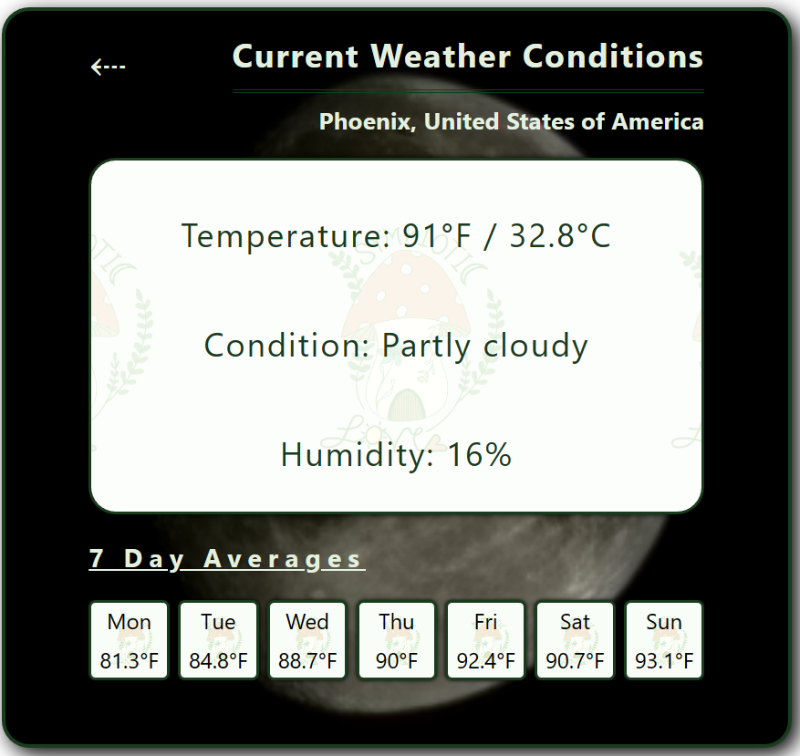

<h1>React weatherWidget Component Powered by WeatherAPI</h1>
This is a weatherWidget component creataed using WeatherAPI. In it's minimized state, it is approximately 60px by 60px and when expanded, approximately
500px by 500px. It does not yet have mobile compatibility, but if you are so inclined it should be easy to add with media-queries targeting screens under 600px. You may also need to modify the minimize behavior, as it currently minimizes to the top left corner of the widget.

&nbsp

If you need any assistance with these media queries or modifications to the minimization function, reach out to us at <a href="mailto:support@symbiotic.love?subject=Support%20Request" alt="Send Us an Email">support@symbiotic.love</a>. These will likely be updated by us at some point in the future, though we are not sure when.
<h2>WeatherAPI API key</h2>
For this component to be functional, you will need to add a WeatherAPI API key at line #19, "const API_KEY = 'INSERT API KEY HERE';". If you are an employer, you may reach out to <a href="mailto:matthew@symbiotic.love?subject=Support%20Request" alt="Get a Test Key">matthew@symbiotic.love</a> for a test key. Otherwise, you can get your own API key for free by visitng https://www.weatherapi.com/ and signing up for an account. This will work for personal use or testing. If you plan to publish this publicly, you will need to modify this line to instead retrieve an environment variable storing your API key. If you require any assistance setting this up, please reach out to <a href="mailto:support@symbiotic.love?subject=Support%20Request" alt="Send Us an Email">support@symbiotic.love</a>.
<h3>Functionality</h3>
<h4>Minimized Widget</h4>
The minimized version of the widget will display the abbreviated day of the week and the average temperature for the day. It is approximately 60px by 60px.

&nbsp

<h4>Full Widget</h4>
When clicked, the full widget will be expanded. The full widget will show your location as well as temperature, condition and humidity. It is approximately 500px by 500px. At the bottom of the widget, there is a forecast for today and the next 6 days showing the abbreviated day name and average temperature the same as the minimized widget does.

&nbsp

<h4>Detailed Information</h4>
When these are clicked, a window showing more detailed weather information such as highs and lows, sunrise, sunset, UV index, and more are displayed. This window can be moved within the widget.

&nbsp

<h4>Day/Night Transition</h4>
Between 6a and 6p local time, the widget will display a cloudy day background. Between 6p and 6a, it will display a moon.

&nbsp

